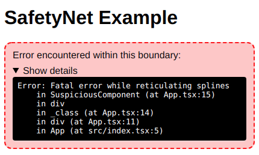

# react-safetynet

react-safetynet provides a simple way to encapsulate errors, preventing them from
crashing your app completely. Upon receiving an error from one of its children,
the component will swap it's contents with an explanation of what went wrong.

## Usage

### JavaScript

```jsx
import SafetyNet from 'react-safetynet';

class App extends React.Component {
   render() {
      return (
         <div>
            <h1>SafetyNet Example</h1>

            <SafetyNet>
               {/* The following component throws an error in its render() method */}
               <SuspiciousComponent></SuspiciousComponent>
            </SafetyNet>
         </div>
      );
   }
}
```

### Result


